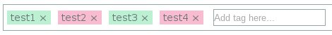

# Angular TagEditor

[![GitHub version][versionImage]][repository]
[![Build Status][buildBadge]][travis]
[![DevDependency Status][devDependencyBadge]][devDependencyStatus]

[versionImage]: https://badge.fury.io/gh/Forumouth%2Fangular-tageditor.svg
[repository]: https://badge.fury.io/gh/Forumouth%2Fangular-tageditor
[buildBadge]: https://travis-ci.org/Forumouth/angular-tageditor.svg?branch=master
[travis]: https://travis-ci.org/Forumouth/angular-tageditor
[devDependencyBadge]: https://david-dm.org/Forumouth/angular-tageditor/dev-status.svg
[devDependencyStatus]: https://david-dm.org/Forumouth/angular-tageditor

## What's this?



It is tageditor for AngularJS

## Why did you invent it?

I want a tageditor for AngularJS, and I found a lot of tageditors, but they are for ReactJS. Then I found some tageditors for AngularJS, but they are not well-tested and/or has invalid tags (moreover can't use script-side styling). These reasons are enough to re-develop tageditors.

## How to install angular-tageditor

Currently WIP

## How to use it?

This repository generates 2 files; `dist/assets.css` for styling, and `dist/angular-tageditor.js` for scripting. And of course, you will require to have [jQuery](https://jquery.com/) and [AngularJS](https://angularjs.org/) installed.

Here is the example:

`index.html`
```html
<!DOCTYPE html>
<html lang="en">
<head>
  <meta charset="UTF-8">
  <title>Angular Tageditor Example</title>
  <script src="bower_components/jquery/dist/jquery.js"></script>
  <script src="bower_components/angular/angular.js"></script>
  <script src="bower_components/angular-mocks/angular-mocks.js"></script>
  <script src="dist/angular-tageditor.js"></script>
  <link rel="stylesheet" href="dist/assets.css">
  <script>
    (function () {
      angular.module("test", [
        "ngTagEditor"
      ]).controller("mainController", [
        "$scope",
        function (scope) {
          scope.tags = ["test1", "test2", "test3"];
        }
      ]);
    }).call(this);
  </script>
</head>
<body data-ng-app="test"
  data-ng-controller="mainController">
  <h1>AngularJS Tag Editor Example</h1>
  <textarea class="ng-tag-editor"
    data-ng-model="tags">
  </textarea>
</body>
</html>
```

WIP
